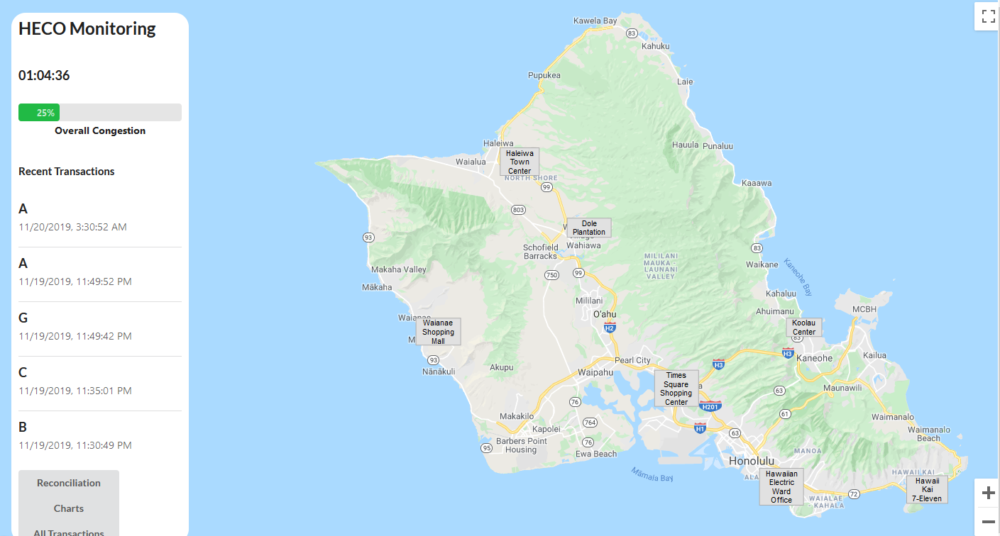

### HECO Charge 

Members
- Damien
- Ian
- Jeremy

## Mission Statement
HECO Charge is a monitoring system that checks every transaction for errors. Our project was born out of a conversation with the lead manager for the HECO Charging Station unit. Their team had to manually generate reports every month, and look through each transaction individually for any errors. We saw a great opportunity to automate this process for HECO, with the end result being 'HECO Charge'.

### `Google Maps`

Using Google Maps to provide a graphical interface, we were able to showcase the various charging stations throughout Oahu. A modified version of google-maps-react was used to place interactive stations, that when clicked will expand into a detailed list of the specified station. 

### `Mobile Version`

Using a built in tracker in React which allows to get the width and height of the screen at any time, we were able to create a Mobile-Friendly version of our site. We set the parameters to 500 pixels, such that any screen with a lower pixel count will display the mobile site.

The mobile site varies from the desktop version in that we don't display the map. Upon testing, we noticed that the limitations of a low width screen distorted the island of Oahu to where buttons were not feasibly intractable. We decided that this information, while useful on the Desktop, will not provide the same level of useful information. Using this guideline, we were able to tailor our mobile version to what we expect is needed from the managerial level at HECO. 

## Technology Stack

Builds the app for production to the `build` folder. 
It correctly bundles React in production mode and optimizes the build for the best performance.

### `AWS`

The primary processing is done using AWS Lambda. We decided from the start to create this project serverless. Our primary motivation was purely educational, we wanted to test writing serverless code. We have two primary lambdas:

- checkNewInsert
Individually checks each transaction for any errors that needs to be manually corrected. This was our major milestone that we believed would provide the most use to HECO. 
- getStationData
We dedicated a majority of the time to simulating station data across multiple stations. This lambda will create data in any time range, using paramaters given from sample data. 

### `PostgreSQL on Heroku`
Our primary database was PostgreSQL. We leaned towards a modern database verus known traditional databases for performance reasons. AWS Lambda was able to perform around twice as fast versus Microsoft SQL Server from internal testing on Amazon, so we decided on PostgreSQL to improve our lambdas, and also to learn a new database.

## How to setup enverionment

### `npm install --save`

Saves the dependencies used on project

### `npm run`

Runs local development on localhost

### `npm run eject`
TBA: We planned on creating a custom Google Maps React plugin, but ran into numerous errors. However, in the event that you wish to test our custom plugin, please run the above command.

